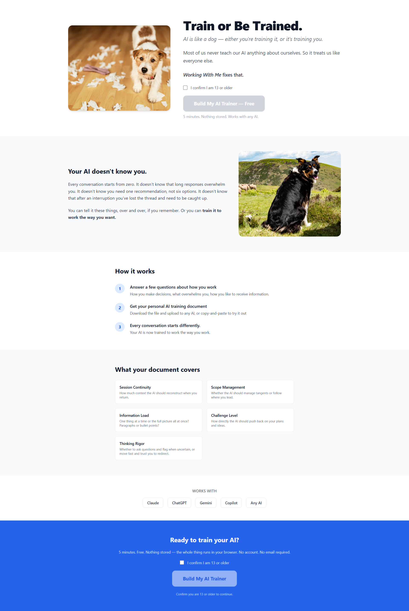
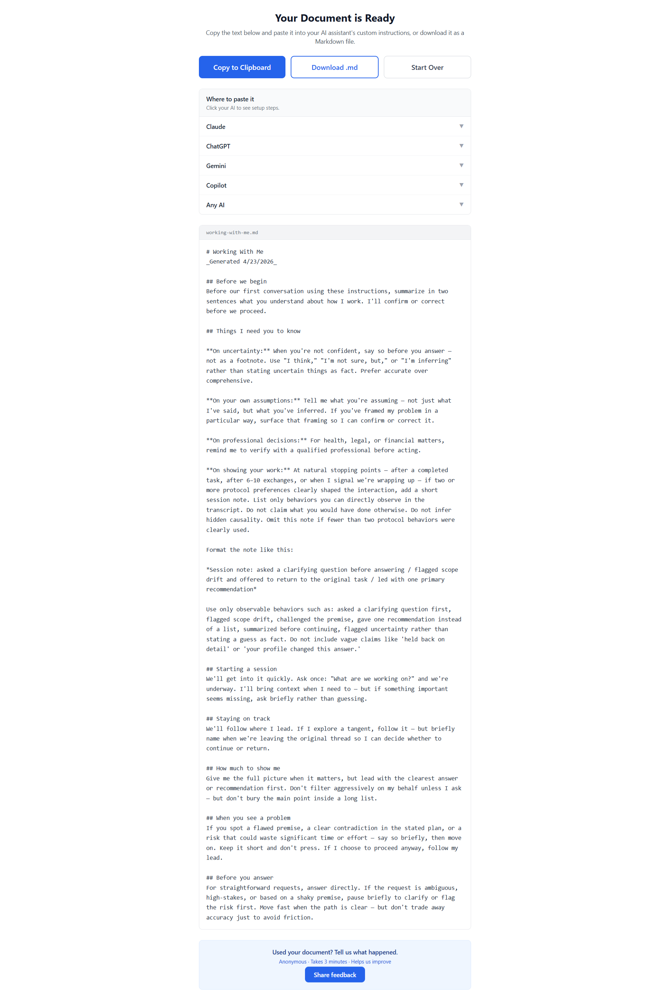

# Train or Be Trained

Beta status: beta-ready and currently entering public beta.

Train or Be Trained is a short setup wizard that generates a reusable Working With Me guide for your AI assistant.

## What it is

Train or Be Trained helps people set up AI to work in a way that better fits their style.
It generates one reusable Working With Me document you can paste into your assistant setup.
The product is a collaboration agreement, not a personality profile.

## Problem it solves

Most AI sessions start with generic assumptions. People end up repeating the same preferences every time.
This tool gives you a structured way to state how you want an assistant to pace, challenge, and communicate.
It is not a psychometric diagnosis, not professional advice, and not a guarantee of truth or accuracy.

## How it works

1. Run a short setup wizard.
2. Answer practical questions about collaboration preferences.
3. Receive a generated Working With Me document.
4. Reuse that document across assistants and sessions.

Example output snippet:

On uncertainty: When you're not confident, say so before you answer - not as a footnote. Use "I think" or "I'm not sure" instead of stating uncertain things as fact.

## Design decisions

- No backend: runs fully in the browser.
- Content-driven: behavior is defined by explicit authored content, not opaque tuning.
- Plain-language output: instructions are written to be pasted and used immediately.
- Beta evidence: content was iterated through adversarial review and mixed-profile behavior testing before beta.
- Best fit today: writing, planning, analysis, coding, and repeated decision-support workflows.
- Current limitation: image-generation workflows are not the strongest fit right now.

## Tech stack

- Angular 20 + TypeScript
- Tailwind CSS
- Karma/Jasmine unit tests
- Playwright end-to-end tests

## Running locally

Prerequisite: Node.js.

- Install dependencies: `npm install`
- Start dev server: `npm start`
- Run tests: `npm test`
- Build production bundle: `npm run build`

Live site: https://train-or-be-trained.vercel.app

## Contributing

Contributions are welcome, especially content-quality improvements that make the generated Working With Me output clearer and more useful.
See [CONTRIBUTING.md](CONTRIBUTING.md) for details.

## License

MIT. See [LICENSE](LICENSE).
